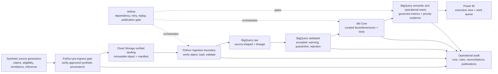
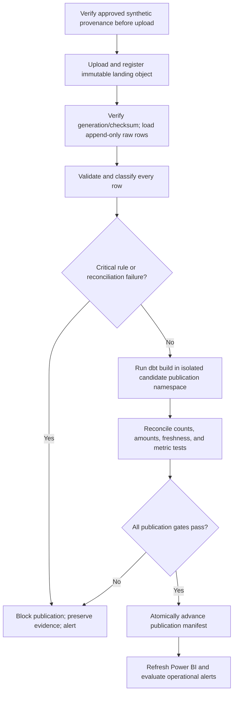

# ClaimsFlow architecture baseline

**Status:** Accepted Phase 0 baseline

**Decision date:** 2026-08-13

**Data boundary:** Synthetic portfolio data only; not a production healthcare system

## Purpose

This architecture turns the ClaimsFlow requirements, source contracts, and metric contracts into explicit implementation boundaries. It favors a small, explainable batch platform that a reviewer can run, test, audit, and discuss. The seven accepted architecture decision records (ADRs) are the authority for implementation choices; this page is their navigational overview.

## System context



## Non-negotiable boundaries

1. Only approved synthetic fixtures and generator outputs may enter a ClaimsFlow-managed data path. No PHI, PII, real claim, or real customer data is permitted.
2. Landing objects and raw records are evidence. They are append-only, content-addressed, and never silently corrected.
3. Python owns file registration, contract enforcement, loading, and validation adapters. dbt owns warehouse business transformation, tests, dimensional models, governed metric projections, and the deterministic priority calculation.
4. Airflow owns execution order and recovery policy, not business rules. A failed required gate cannot publish trusted outputs.
5. Power BI reads semantic and operational models only. It cannot query landing, raw, quarantine, or transformation-internal datasets.
6. Every published dataset has a manifest tying source batches to contract versions, code commit, dbt artifacts, affected warehouse/BI partition ranges, quality results, reconciliation results, and publication time.
7. Infrastructure and deployment behavior are version-controlled. CI uses short-lived federated credentials and environment approvals; long-lived cloud keys are prohibited.

## Logical data layers

| Layer | Physical boundary | Owner | Mutability | Consumer |
| --- | --- | --- | --- | --- |
| Landing | Cloud Storage verified-synthetic objects and delivery manifests | Ingestion | Append-only; generation and SHA-256 recorded | Python ingestion |
| Raw | BigQuery source-shaped tables | Ingestion | Append-only by batch and source record | Validation only |
| Validated | BigQuery accepted/warned records plus separate quarantine/rejection evidence | Data quality | Rebuilt or merged from immutable raw evidence | dbt staging |
| Curated | BigQuery facts, dimensions, bridges, and history | Analytics engineering | Candidate writes scoped to a publication; active versions immutable | Semantic models |
| Semantic | BigQuery governed KPI components and reporting views | Analytics engineering | Candidate writes scoped to a publication; active versions immutable | Power BI and reconciliation |
| Operational | BigQuery priority queue, alerts, and actionable status marts | Revenue-cycle analytics | Candidate writes scoped to a publication; active versions immutable | Power BI and operators |
| Audit | BigQuery batch, task, validation, reconciliation, and publication records | Platform engineering | Append-only events with controlled status transitions | Operators and reviewers |

No consumer may bypass a layer to recreate business logic from a less-governed predecessor.

Candidate isolation is physical, not just a delayed status flag. dbt writes append-only result versions and an immutable membership delta under a candidate `publication_id`; its merge keys include that ID and cannot update rows selected by the active publication. The candidate manifest inherits the prior successful membership chain, adds changed-key mappings or tombstones, and therefore defines a complete logical snapshot without rebuilding unchanged result rows. Consumer views first resolve the single active publication manifest, reduce its bounded membership chain to the latest mapping per business key, and join those mappings to result versions. Advancing or rolling back that one manifest pointer changes the complete consumer snapshot. Failed candidates remain unreachable and are retained for diagnosis before lifecycle cleanup; controlled compaction creates a new isolated base manifest when chain depth reaches its configured limit.

## Runtime and release flow



Every stage uses `environment_id`, `run_id`, `batch_id`, and the applicable contract or rule version. Replay selects explicit batch IDs or a bounded UTC data interval. A full refresh requires approval and never deletes landing or raw evidence.

## Environment model

| Environment | Purpose | Data | Cloud boundary | Deployment |
| --- | --- | --- | --- | --- |
| Local | Developer feedback and deterministic tests | Small synthetic fixtures | Local containers/emulators where practical; isolated developer cloud sandbox only when required | Manual local commands |
| Dev/demo | Shared portfolio integration and demonstration | Versioned synthetic generator output | Dedicated GCP project, buckets, datasets, identities, budgets, and Power BI workspace | GitHub Actions after review and environment approval |

There is no production environment in version 1. A future production design handling real regulated data requires a new threat model, compliance review, data-classification program, business-continuity plan, and replacement ADRs before any data is accepted.

## Decision registry

| ADR | Status | Decision |
| --- | --- | --- |
| [ADR-001](adr/ADR-001-bigquery-data-layers.md) | Accepted | BigQuery data layers, physical design, publication, and cost controls |
| [ADR-002](adr/ADR-002-dbt-transformation-and-semantic-layer.md) | Accepted | dbt transformation, metric, history, and priority-engine ownership |
| [ADR-003](adr/ADR-003-airflow-orchestration-and-replay.md) | Accepted | Airflow orchestration, publication gates, retry, replay, and alerting |
| [ADR-004](adr/ADR-004-python-ingestion-and-validation-boundary.md) | Accepted | Python ingestion and validation boundary |
| [ADR-005](adr/ADR-005-power-bi-connectivity-and-governed-reporting.md) | Accepted | Power BI connectivity, refresh, semantic governance, and report states |
| [ADR-006](adr/ADR-006-security-privacy-and-access-control.md) | Accepted | Synthetic-only security, IAM, secrets, audit, encryption, and retention |
| [ADR-007](adr/ADR-007-environments-ci-cd-observability-and-cost.md) | Accepted | Environments, Terraform, CI/CD, observability, rollback, and cost governance |

## Requirement traceability

The `requirements` and `acceptance_criteria` lists in each ADR's front matter are machine-validated. Together, the seven decisions cover every one of the 80 baseline requirements and its exact primary acceptance criterion.

| Decision | Primary coverage |
| --- | --- |
| ADR-001 | Physical warehouse layers and scale/performance: `FR-WH-001` through `FR-WH-003`, `FR-WH-008`; `NFR-PERF-001` through `NFR-PERF-004` |
| ADR-002 | dbt model governance, tests, history, reconciliation, metrics, and prioritization: `FR-WH-004` through `FR-WH-007`; `FR-MET-001` through `FR-MET-005`; `FR-PRI-001` through `FR-PRI-007` |
| ADR-003 | Alerts, orchestration, and reliability: `FR-ALT-001` through `FR-ALT-007`; `FR-OPS-001` through `FR-OPS-006`; `NFR-REL-001` through `NFR-REL-005` |
| ADR-004 | Ingestion, lineage, validation, and quarantine: `FR-ING-001` through `FR-ING-008`; `FR-DQ-001` through `FR-DQ-010` |
| ADR-005 | Executive and operational reporting: `FR-BI-001` through `FR-BI-004` |
| ADR-006 | Privacy, security, and auditability: `NFR-SEC-001` through `NFR-SEC-006`; `NFR-AUD-001` through `NFR-AUD-005` |
| ADR-007 | Maintainability and reproducibility: `NFR-MNT-001` through `NFR-MNT-005` |

## Decision governance

- ADR IDs are sequential and never change or get reused.
- An accepted ADR is immutable except for typo, formatting, or reference repairs that do not change the decision.
- A material change adds the next sequential ADR with `supersedes` pointing to the replaced decision; the old ADR becomes `superseded` in the same pull request. A superseded ADR must have exactly one successor, and only the accepted leaf of each decision chain is active.
- Every implementation pull request names the relevant requirement IDs and ADRs.
- The automated architecture validator checks structure, approved baseline ownership, exact requirement-to-acceptance mapping, complete active baseline coverage, supersession integrity, official references, internal links, whitespace, and the registry.
- Revisit triggers are conditions for a new decision, not permission to drift silently from the baseline.

## Validation

Run the complete architecture documentation checks from the repository root:

```bash
ruby scripts/validate_architecture_decisions.rb
ruby scripts/test_architecture_decision_validator.rb
```

The architecture workflow runs these commands for pull requests and changes to `main`. Existing source-contract and metric-dictionary validators remain independent release gates.
